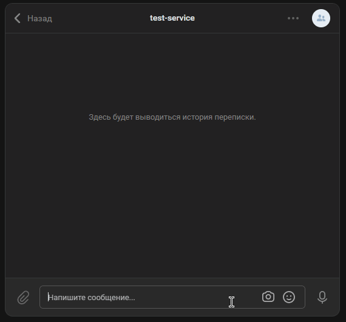

## vk bot

бот, цитирующий присланный текст <details><summary>_vk bot_</summary>
   </details>

### Использование

Запуск сервиса с помощью [docker-compose](./docker-compose.yml):

```
docker compose up -d
```

#### Переменные

Необходимо добавить [.env](.env.example) файл со следующими переменными:

- `NGROK_AUTHTOKEN` - токен из аккаунта на https://ngrok.com/
- `VK_API_VERSION` - версия api (последняя на данный момент - 5.236)
- `VK_ACCESS_TOKEN` - ключ доступа сообщества
- `VK_CONFIRMATION_TOKEN` - строка для подтверждения адреса сервера
- `VK_GROUP_ID` - id сообщества

#### Конфигурация

- Работа с API:
  - создать ключ доступа с доступом к сообщениям сообщества, добавить его в переменную `VK_ACCESS_TOKEN`
  - настроить и подтвердить сервер в Callback API
    - выбрать версию в соответствии с переменной `VK_API_VERSION`
    - адрес сервера ngrok можно найти по ссылке http://localhost:4040/
    - добавить в переменную `VK_CONFIRMATION_TOKEN` строку, которую должен вернуть сервер
  - выбрать тип события - входящее сообщение
- включить сообщения сообщества и возможность использования ботов

### Описание

- для взаимодействия с vk api используется [WebClient](./src/main/kotlin/com/task/bot/config/ClientConfig.kt) и [HttpExchange](./src/main/kotlin/com/task/bot/client/VkClient.kt)
- каждое [событие](./src/main/kotlin/com/task/bot/model/vk/callback/VkCallback.kt) может иметь свою [реализацию](./src/main/kotlin/com/task/bot/model/vk/callback) и формат поля "object" в зависимости от поля "type"
- аналогично для событий есть свой [обработчик](./src/main/kotlin/com/task/bot/handler), в котором реализуется нужная логика
